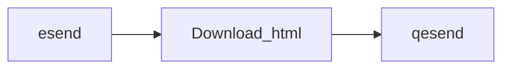

# GUI to check AADE-esend data

## Instructions

- Login to esend
- Download html page with data
- Open html file with qesend.exe

## Download the latest release [here](https://github.com/tedlaz/qesend/releases/latest/download/qesend_install.exe)

